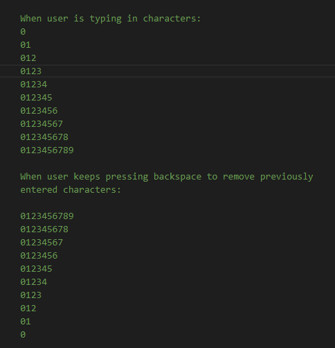

# Automated aAnNsS Password Generator App
### About Project
aAnNsS password generator app features are drawn from javascript development environment automation and Github's colorful percentage display of code that make up user's repo. The app is made up a genarator, analyser (graphical analysis of the password make up) and strength checker.
Created during Google Africa Developers scholarship 2020 program (learning phase 2).
view live on [Github Pages](https://ifycode.github.io/Automated-aAnNsS-Password-Generator-App/).

### User Input Logic
The image below shows an example of a 10 digit password (i.e. string with index of 0 - 9) will be generated each time the user adds to or deletes a character from the "allowedCharacters" input field in an orderly manner:

When user enters or deletes characters in an orderly manner, there is no issue. When characters are not entered in an orderly manner, some [issues](https://github.com/Ifycode/Automated-aAnNsS-Password-Generator-App/issues/3) are present.

### How aAnNsS works
Users only need the first letters from the words alphabeth, number & symbol to generate random characters for their password on the fly:
* a generates random lowercase alphabeth
* A generates random uppercase alphabeth
* n or N generates random number
* s or S generates random symbol
* Password length must have between 8 - 64 characters for the copy button to be enabled.

### Github Branches
* master: Contains the whole (node) package except node_modules folder.
* gh-pages: Files generated to dist folder sent here for hosting.
* vanilla: Contains the plain html, css and js anyone can relate with.

### Appreciation
Thanks to Google, Andela and pluralsight for this opportunity. Thanks to my supportive big brothers: Obiagba Ndidi (helped with maths for the analyser component), Obiagba Joseph & Obiagba Israel (dev mentors).
